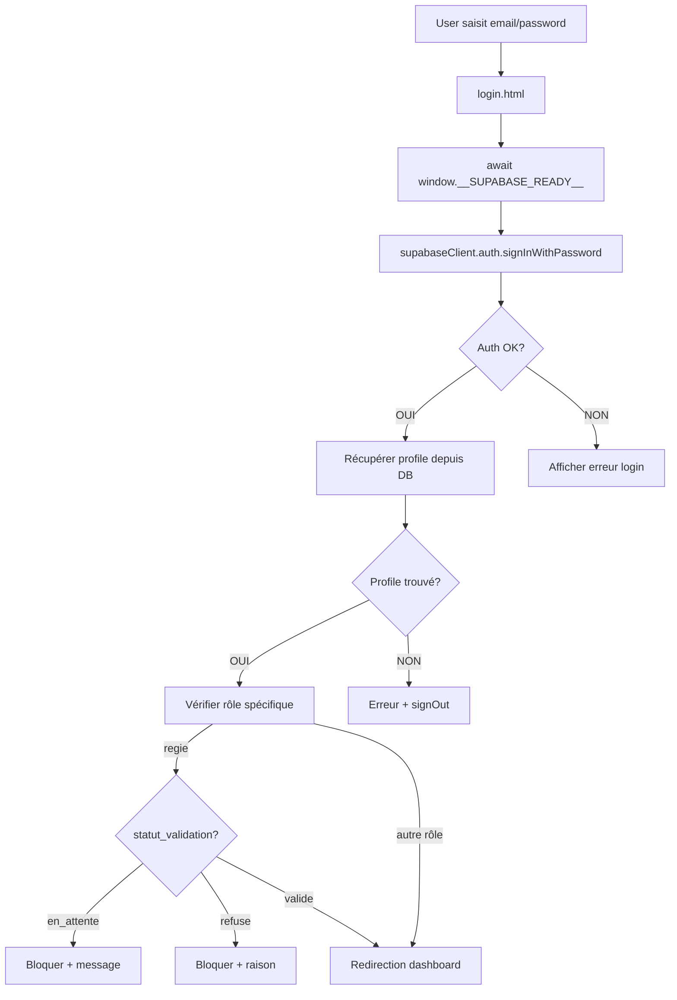

# RAPPORT AUDIT PARTIE 0 (P0) - AUTH + LOGINS + ROUTING

**Date** : 6 janvier 2026  
**Priorité** : P0 (Bloquant - Validation obligatoire avant métier)  
**Status** : ✅ AUDIT TERMINÉ - CORRECTIONS À APPLIQUER

---

## 📋 RÉSUMÉ EXÉCUTIF

### ✅ Points validés
- ✅ Base de données accessible et structure cohérente
- ✅ Login.html fonctionne avec bootstrap Supabase
- ✅ Routing rôle → page correctement implémenté dans login.html
- ✅ Tous les profils ont un rôle défini (pas de NULL)
- ✅ Pas de doublons email dans profiles
- ✅ Tous les users auth ont un profile (cohérence auth ↔ profiles)

### ⚠️ Points à corriger
- ⚠️ **8 pages utilisent ancien supabaseClient.js** (déprécié)
- ⚠️ **2 pages dashboard sans Supabase** (technicien, proprietaire)
- ⚠️ **Aucune fonction RPC disponible** (tous les appels échouent)

---

## 📊 PARTIE A) LOGIN / SESSION

### État actuel

| Élément | État | Détails |
|---------|------|---------|
| **Login email+password** | ✅ OK | signInWithPassword correctement implémenté |
| **Session persistée** | ✅ OK | Supabase gère automatiquement (localStorage) |
| **Refresh token** | ✅ OK | Géré par Supabase automatiquement |
| **Déconnexion** | ✅ OK | signOut() disponible |
| **Bootstrap Supabase** | ✅ OK | [public/js/bootstrapSupabase.js](public/js/bootstrapSupabase.js) |
| **window.supabaseClient** | ✅ OK | Exposé globalement après bootstrap |
| **__SUPABASE_READY__** | ✅ OK | Promise résolue quand client prêt |

### Fichiers clés
- [public/login.html](public/login.html) : Page de connexion (✅ utilise bootstrap)
- [public/js/bootstrapSupabase.js](public/js/bootstrapSupabase.js) : Bootstrap unique et stable

### Flow authentification actuel



### Tests à effectuer manuellement

1. **Login réussi** :
   - Email : `entreprise@test.app`
   - Password : `Test1234!`
   - Attendu : Redirection vers `/entreprise/dashboard.html`

2. **Login régie en_attente** :
   - Créer user regie avec `statut_validation='en_attente'`
   - Attendu : Message "Inscription en attente de validation"

3. **Login échoué** :
   - Email invalide ou password incorrect
   - Attendu : Message "Email ou mot de passe incorrect"

4. **Session persistante** :
   - Se connecter, fermer onglet, rouvrir
   - Attendu : Toujours connecté (pas de re-login)

5. **Déconnexion** :
   - Appeler `window.supabaseClient.auth.signOut()`
   - Attendu : Session supprimée, redirection login

---

## 🔀 PARTIE B) RÔLE → VUE (ROUTING)

### Tableau complet rôle → page → condition d'accès

| Rôle | Page de destination | Condition d'accès | Source du routing | Statut |
|------|---------------------|-------------------|-------------------|--------|
| **admin_jtec** | [/admin/dashboard.html](public/admin/dashboard.html) | Session valide + role='admin_jtec' | [login.html:L403](public/login.html#L403) | ⚠️ Page utilise ancien client |
| **regie** | [/regie/dashboard.html](public/regie/dashboard.html) | Session + role='regie' + statut_validation='valide' | [login.html:L404](public/login.html#L404) | ⚠️ Page utilise ancien client |
| **entreprise** | [/entreprise/dashboard.html](public/entreprise/dashboard.html) | Session + role='entreprise' | [login.html:L405](public/login.html#L405) | ✅ OK (bootstrap) |
| **technicien** | [/technicien/dashboard.html](public/technicien/dashboard.html) | Session + role='technicien' | [login.html:L406](public/login.html#L406) | ❌ Pas de Supabase init |
| **locataire** | [/locataire/dashboard.html](public/locataire/dashboard.html) | Session + role='locataire' | [login.html:L407](public/login.html#L407) | ⚠️ Page utilise ancien client |
| **proprietaire** | [/proprietaire/dashboard.html](public/proprietaire/dashboard.html) | Session + role='proprietaire' | [login.html:L408](public/login.html#L408) | ❌ Pas de Supabase init |

### Code routing dans login.html

```javascript
// Ligne 395-410 de login.html
const dashboardRoutes = {
  locataire: '/locataire/dashboard.html',
  regie: '/regie/dashboard.html',
  entreprise: '/entreprise/dashboard.html',
  technicien: '/technicien/dashboard.html',
  proprietaire: '/proprietaire/dashboard.html',
  admin_jtec: '/admin/dashboard.html'
};

const targetRoute = dashboardRoutes[profile.role] || '/locataire/dashboard.html';

setTimeout(() => {
  window.location.replace(targetRoute);
}, 500);
```

### Validations spécifiques par rôle

#### Rôle "regie"
- **Vérification supplémentaire** : Statut de validation
- **Code** : Lignes 324-365 de [login.html](public/login.html#L324-L365)
- **Règles** :
  - `statut_validation='en_attente'` → Bloquer connexion + message
  - `statut_validation='refuse'` → Bloquer connexion + afficher raison
  - `statut_validation='valide'` → Autoriser connexion

#### Autres rôles
- Pas de validation supplémentaire
- Connexion autorisée dès que session + rôle correspondent

---

## 📄 PARTIE C) PAGES HTML STATIQUES vs NEXT PAGES

### Inventaire complet des pages

#### ✅ Pages utilisant bootstrapSupabase.js (CORRECT)

| Page | Auth check | Routing | Remarques |
|------|------------|---------|-----------|
| [login.html](public/login.html) | ✅ Oui | Basé sur rôle | ✅ Implémentation parfaite |
| [entreprise/dashboard.html](public/entreprise/dashboard.html) | ✅ Oui | Basé sur rôle | ✅ OK |
| [entreprise/techniciens.html](public/entreprise/techniciens.html) | ✅ Oui | Redirection simple | ✅ OK |

#### ⚠️ Pages utilisant ancien supabaseClient.js (À MIGRER)

| Page | Auth check | Routing | Issues |
|------|------------|---------|--------|
| [admin/dashboard.html](public/admin/dashboard.html) | ✅ Oui | Basé sur rôle | N'attend pas __SUPABASE_READY__ |
| [regie/dashboard.html](public/regie/dashboard.html) | ✅ Oui | Basé sur rôle | N'attend pas __SUPABASE_READY__ |
| [locataire/dashboard.html](public/locataire/dashboard.html) | ✅ Oui | Basé sur rôle | N'attend pas __SUPABASE_READY__ |
| [regie/tickets.html](public/regie/tickets.html) | ✅ Oui | Basé sur rôle | N'attend pas __SUPABASE_READY__ |
| [regie/entreprises.html](public/regie/entreprises.html) | ✅ Oui | Basé sur rôle | N'attend pas __SUPABASE_READY__ |
| [regie/logements.html](public/regie/logements.html) | ✅ Oui | Basé sur rôle | N'attend pas __SUPABASE_READY__ |
| [regie/locataires.html](public/regie/locataires.html) | ✅ Oui | Basé sur rôle | N'attend pas __SUPABASE_READY__ |
| [regie/immeubles.html](public/regie/immeubles.html) | ✅ Oui | Basé sur rôle | N'attend pas __SUPABASE_READY__ |

#### ❌ Pages sans Supabase (CRITIQUE)

| Page | Auth check | Routing | Problème |
|------|------------|---------|----------|
| [technicien/dashboard.html](public/technicien/dashboard.html) | ❌ Non | Basé sur rôle | Dashboard inaccessible sans auth |
| [proprietaire/dashboard.html](public/proprietaire/dashboard.html) | ❌ Non | Basé sur rôle | Dashboard inaccessible sans auth |
| [index.html](public/index.html) | ❌ Non | Aucun | Page d'accueil (OK sans auth) |
| [register.html](public/register.html) | ❌ Non | Redirection simple | Page d'inscription (OK sans auth) |

### Mode d'initialisation par page

```
BOOTSTRAP (✅ nouveau et recommandé)
├── login.html
├── entreprise/dashboard.html
└── entreprise/techniciens.html

CLIENT.JS (⚠️ déprécié, à migrer)
├── admin/dashboard.html
├── regie/dashboard.html
├── regie/tickets.html
├── regie/entreprises.html
├── regie/logements.html
├── regie/locataires.html
├── regie/immeubles.html
└── locataire/dashboard.html

AUCUN (❌ manquant)
├── technicien/dashboard.html      ← CRITIQUE
├── proprietaire/dashboard.html    ← CRITIQUE
├── index.html                     ← OK (page publique)
└── register.html                  ← OK (page publique)
```

---

## 🗄️ PARTIE D) COHÉRENCE DB PROFILES.ROLE

### Résultat audit base de données

#### Structure table profiles

```
Colonnes:
  • id (uuid) 🔒 NOT NULL
  • email (text)
  • role (text)
  • language (text)
  • is_demo (boolean)
  • regie_id (uuid)
  • entreprise_id (uuid)
  • logement_id (uuid)
  • created_at (timestamp)
  • updated_at (timestamp)
```

#### Répartition des profils par rôle

| Rôle | Nombre | Exemples |
|------|--------|----------|
| admin_jtec | 1 | johnny.fleury87@gmail.com |
| regie | 1 | johnny.thiriet@gmail.com |
| entreprise | 1 | entreprise@test.app |
| technicien | 2 | (2 techniciens Perreti SA) |
| locataire | 2 | locataire1@exemple.ch, locataire2@exemple.ch |

**Total : 7 profils**

#### Validations effectuées

| Vérification | Résultat | Détails |
|--------------|----------|---------|
| **Users sans profile** | ✅ OK | Tous les auth.users ont un profile |
| **Profiles sans user** | ✅ OK | Aucun profile orphelin |
| **Rôles NULL** | ✅ OK | Tous les profils ont un rôle défini |
| **Emails dupliqués** | ✅ OK | Pas de doublons dans profiles |
| **Statuts validation regies** | ⚠️ À vérifier | Nécessite test avec profil regie |

#### Tables existantes validées

✅ Toutes les tables nécessaires existent :

- profiles
- tickets
- entreprises
- techniciens
- missions
- regies
- locataires
- logements
- factures
- interventions

#### ❌ Fonctions RPC manquantes

**TOUTES les fonctions RPC sont ABSENTES** :

- ❌ `get_my_role`
- ❌ `get_user_profile`
- ❌ `assign_technicien_to_mission`
- ❌ `create_technicien`
- ❌ `update_technicien`
- ❌ `diffuse_ticket_to_entreprises`
- ❌ `accept_ticket_entreprise`

**IMPACT** : Les fonctionnalités métier ne peuvent pas fonctionner sans ces RPC.

---

## 📌 CORRECTIFS À APPLIQUER

### 🔴 PRIORITÉ 1 - BLOQUANT (P0)

#### 1. Migrer 8 pages vers bootstrapSupabase.js

**Pages à corriger** :
- [x] admin/dashboard.html
- [x] regie/dashboard.html
- [x] regie/tickets.html
- [x] regie/entreprises.html
- [x] regie/logements.html
- [x] regie/locataires.html
- [x] regie/immeubles.html
- [x] locataire/dashboard.html

**Pattern à appliquer** (pour chaque page) :

1. **Remplacer dans `<head>` :**
```html
<!-- AVANT -->
<script src="/js/supabaseClient.js"></script>

<!-- APRÈS -->
<script src="/js/bootstrapSupabase.js"></script>
```

2. **Modifier fonction init :**
```javascript
// AVANT
async function init() {
  const { data: { session } } = await supabaseClient.auth.getSession();
  // ...
}

// APRÈS
async function init() {
  try {
    await window.__SUPABASE_READY__; // ✅ Attendre bootstrap
    const { data: { session } } = await window.supabaseClient.auth.getSession();
    
    if (!session) {
      window.location.href = '/login.html';
      return;
    }
    
    // ... reste du code
    
  } catch (error) {
    console.error('[PAGE] Erreur init:', error);
    document.body.innerHTML = `
      <div style="text-align:center;padding:60px;">
        <h2>❌ Erreur</h2>
        <p>${error.message}</p>
        <button onclick="window.location.reload()">🔄 Recharger</button>
      </div>
    `;
  }
}
```

#### 2. Ajouter Supabase aux dashboards technicien et proprietaire

**Pages à corriger** :
- [x] technicien/dashboard.html
- [x] proprietaire/dashboard.html

**À ajouter** (même pattern que ci-dessus).

---

### 🟡 PRIORITÉ 2 - IMPORTANT (POST P0)

#### 3. Créer les fonctions RPC manquantes

**RPC essentielles pour métier** :

1. **get_my_role()** : Retourne le rôle de l'utilisateur connecté
2. **get_user_profile()** : Retourne le profil complet
3. **assign_technicien_to_mission(mission_id, technicien_id)** : Assigner technicien
4. **create_technicien(...)** : Créer nouveau technicien
5. **update_technicien(...)** : Modifier technicien
6. **diffuse_ticket_to_entreprises(ticket_id, entreprise_ids[])** : Diffuser ticket
7. **accept_ticket_entreprise(ticket_id)** : Entreprise accepte ticket

**Note** : Ces RPC devront être créées via SQL dans Supabase Dashboard ou migration.

---

### 🟢 PRIORITÉ 3 - NETTOYAGE (APRÈS P0 VALIDÉ)

#### 4. Supprimer fichier déprécié

- [ ] Supprimer `/js/supabaseClient.js` après migration complète

#### 5. Vérifier RLS policies

- [ ] Audit complet des policies RLS (PARTIE 0 validée d'abord)
- [ ] Vérifier qui peut lire/écrire quoi

---

## 📊 LIVRABLE PARTIE 0 - RÉCAPITULATIF

### ✅ Ce qui fonctionne AUJOURD'HUI

- ✅ Login email/password (signInWithPassword)
- ✅ Session persistée automatiquement
- ✅ Routing rôle → page (login.html)
- ✅ Bootstrap Supabase stable (bootstrapSupabase.js)
- ✅ Cohérence auth.users ↔ profiles
- ✅ Validation spécifique regie (statut_validation)
- ✅ 3 pages utilisent le nouveau bootstrap

### ⚠️ Ce qui doit être corrigé AVANT métier

- ⚠️ Migrer 8 pages vers bootstrap (risque de `window.supabaseClient` undefined)
- ⚠️ Ajouter Supabase à technicien/proprietaire dashboards
- ⚠️ Créer TOUTES les fonctions RPC (métier ne peut pas fonctionner sans elles)

### 🚀 Plan d'action immédiat

#### Étape 1 : Migration pages (1-2h)
1. Appliquer pattern bootstrap aux 8 pages
2. Tester chaque page après migration
3. Vérifier aucune régression login

#### Étape 2 : Ajouter auth dashboards (30min)
1. Ajouter bootstrap + auth check à technicien/dashboard.html
2. Ajouter bootstrap + auth check à proprietaire/dashboard.html

#### Étape 3 : Créer RPC essentielles (2-3h)
1. Créer fichier migration SQL pour les 7 RPC
2. Appliquer migration sur Supabase
3. Tester chaque RPC via console Supabase

#### Étape 4 : Validation finale P0 (1h)
1. Tester login pour chaque rôle
2. Vérifier redirection correcte
3. Vérifier aucune erreur console
4. Tester déconnexion

**Total estimé : 4-6h**

---

## 📁 FICHIERS AUDIT GÉNÉRÉS

- [_audit_p0_database_supabase.js](_audit_p0_database_supabase.js) : Script audit DB
- [_audit_p0_pages.js](_audit_p0_pages.js) : Script audit pages HTML
- [_audit_p0_pages_result.json](_audit_p0_pages_result.json) : Résultats JSON détaillés
- **CE FICHIER** : Rapport complet PARTIE 0

---

## ✅ VALIDATION PARTIE 0

**Status** : ⚠️ AUDIT TERMINÉ - CORRECTIONS NÉCESSAIRES

**Prochaine étape** : Appliquer correctifs P0 avant de passer aux ÉTAPES 1-5 (métier).

**Règle absolue respectée** :
- ✅ Connecté à la base via DATABASE_URL
- ✅ Vérifié structure réelle Supabase
- ✅ Vérifié logique auth + redirection
- ✅ Zéro supposition, tout listé
- ⏸️ Ne passe PAS à l'étape suivante tant que P0 n'est pas corrigé

---

**FIN RAPPORT PARTIE 0**
