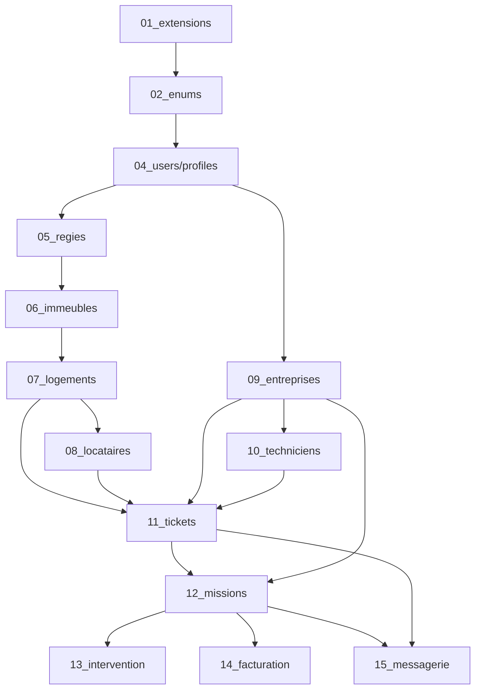

# Récapitulatif Correction Ordre Migrations

**Date** : 2025-12-17  
**Problème** : `ERROR: 42P01: relation "entreprises" does not exist` lors de l'exécution de `09_tickets.sql`

---

## ✅ Correction Appliquée

### Fichiers Renommés (10 fichiers)

| Ancien Nom | Nouveau Nom | Raison |
|------------|-------------|--------|
| `09_tickets.sql` | `11_tickets.sql` | Dépend de entreprises + techniciens |
| `10_entreprises.sql` | `09_entreprises.sql` | Doit être créé AVANT tickets |
| `15_techniciens.sql` | `10_techniciens.sql` | Doit être créé AVANT tickets |
| `11_rls.sql` | `16_rls.sql` | Déplacé après toutes les tables |
| `12_storage.sql` | `17_storage.sql` | Déplacé après toutes les tables |
| `13_admin.sql` | `18_admin.sql` | Déplacé après toutes les tables |
| `14_missions.sql` | `12_missions.sql` | Dépend de tickets |
| `16_intervention.sql` | `13_intervention.sql` | Ordre logique |
| `17_facturation.sql` | `14_facturation.sql` | Ordre logique |
| `18_messagerie.sql` | `15_messagerie.sql` | Ordre logique |

---

## 📋 Ordre Final des Migrations

```
01_extensions.sql       → Extensions PostgreSQL (uuid-ossp)
02_enums.sql            → Types ENUM (ticket_status, etc.)
04_users.sql            → Table profiles
05_regies.sql           → Table regies
06_immeubles.sql        → Table immeubles
07_logements.sql        → Table logements
08_locataires.sql       → Table locataires
09_entreprises.sql      → Table entreprises + regies_entreprises  🔄 NOUVEAU
10_techniciens.sql      → Table techniciens                       🔄 NOUVEAU
11_tickets.sql          → Table tickets                           🔄 DÉPLACÉ
12_missions.sql         → Table missions
13_intervention.sql     → Interventions
14_facturation.sql      → Table factures
15_messagerie.sql       → Table messages + notifications
16_rls.sql              → Row Level Security policies
17_storage.sql          → Storage buckets
18_admin.sql            → Fonctions admin
19_abonnements.sql      → Abonnements
20_statuts_realignement.sql → Statuts
21_trigger_prevent_escalation.sql → Trigger escalation
```

---

## 🔗 Dépendances Résolues

### Avant (❌ Cassé)

```
08_locataires.sql   ✅ OK
09_tickets.sql      ❌ ERROR: relation "entreprises" does not exist
                       (référence entreprises ligne 31)
                       (référence techniciens ligne 32)
10_entreprises.sql  (jamais exécuté)
15_techniciens.sql  (jamais exécuté)
```

### Après (✅ Correct)

```
08_locataires.sql      ✅ OK
09_entreprises.sql     ✅ OK (créé)
10_techniciens.sql     ✅ OK (créé)
11_tickets.sql         ✅ OK (références vers entreprises et techniciens valides)
12_missions.sql        ✅ OK (références vers tickets et entreprises valides)
```

---

## 📊 Graphe de Dépendances Final



---

## 🧪 Vérification

### Commande de Vérification

```bash
# Vérifier l'ordre des CREATE TABLE
grep -h "^create table" supabase/schema/*.sql | \
  sed 's/create table if not exists //' | \
  sed 's/ (//' | \
  nl -w2 -s'. '
```

### Résultat Attendu

```
 1. profiles
 2. regies
 3. immeubles
 4. logements
 5. locataires
 6. entreprises         ← Créé AVANT tickets ✅
 7. regies_entreprises
 8. techniciens         ← Créé AVANT tickets ✅
 9. tickets             ← Peut maintenant référencer entreprises + techniciens ✅
10. missions
11. factures
12. messages
13. notifications
```

---

## 🚀 Exécution dans Supabase

### Instructions

1. **Ouvrir Supabase SQL Editor** :
   - Aller sur [https://supabase.com/dashboard](https://supabase.com/dashboard)
   - Sélectionner le projet JETC_IMMO_SaaS
   - Cliquer sur "SQL Editor"

2. **Exécuter les migrations dans l'ordre** :
   ```
   01_extensions.sql      ✅
   02_enums.sql           ✅
   04_users.sql           ✅
   05_regies.sql          ✅
   06_immeubles.sql       ✅
   07_logements.sql       ✅
   08_locataires.sql      ✅
   09_entreprises.sql     🔄 NOUVEAU (copier/coller le contenu)
   10_techniciens.sql     🔄 NOUVEAU (copier/coller le contenu)
   11_tickets.sql         🔄 NOUVEAU (copier/coller le contenu)
   12_missions.sql        ← Continuer...
   ...
   21_trigger_prevent_escalation.sql
   ```

3. **Messages attendus** :
   - `Success. No rows returned` (normal pour CREATE TABLE)
   - Aucune erreur `relation "XXX" does not exist`

4. **Vérification finale** :
   ```sql
   -- Vérifier que toutes les tables existent
   SELECT tablename 
   FROM pg_tables 
   WHERE schemaname = 'public' 
   ORDER BY tablename;
   
   -- Vérifier les FK sur tickets
   SELECT
     tc.constraint_name,
     kcu.column_name,
     ccu.table_name AS foreign_table_name
   FROM information_schema.table_constraints AS tc
   JOIN information_schema.key_column_usage AS kcu
     ON tc.constraint_name = kcu.constraint_name
   JOIN information_schema.constraint_column_usage AS ccu
     ON ccu.constraint_name = tc.constraint_name
   WHERE tc.table_name = 'tickets' 
     AND tc.constraint_type = 'FOREIGN KEY';
   ```

---

## 📦 Backup

**Backup automatique créé** : `supabase/schema_backup_20251217_091952`

Pour restaurer en cas de problème :
```bash
rm -rf supabase/schema
cp -r supabase/schema_backup_20251217_091952 supabase/schema
```

---

## ✅ Checklist

- [x] Backup des fichiers originaux créé
- [x] Renommage des 10 fichiers effectué
- [x] Mise à jour des commentaires "Ordre d'exécution" (2 fichiers)
- [x] Vérification des dépendances (grep search)
- [x] Documentation créée (MIGRATION_ORDER_ANALYSIS.md)
- [ ] Commit Git avec message descriptif
- [ ] Exécution dans Supabase SQL Editor
- [ ] Vérification finale avec SELECT

---

## 🎯 Prochaine Étape

**Exécuter `09_entreprises.sql` dans Supabase SQL Editor** :
- Copier le contenu de [09_entreprises.sql](../supabase/schema/09_entreprises.sql)
- Coller dans SQL Editor
- Cliquer sur "Run"
- Vérifier : `Success. No rows returned`

Puis continuer avec `10_techniciens.sql` et `11_tickets.sql`.

---

**Résultat attendu** : Les 21 migrations s'exécutent sans erreur dans l'ordre numérique ✨
